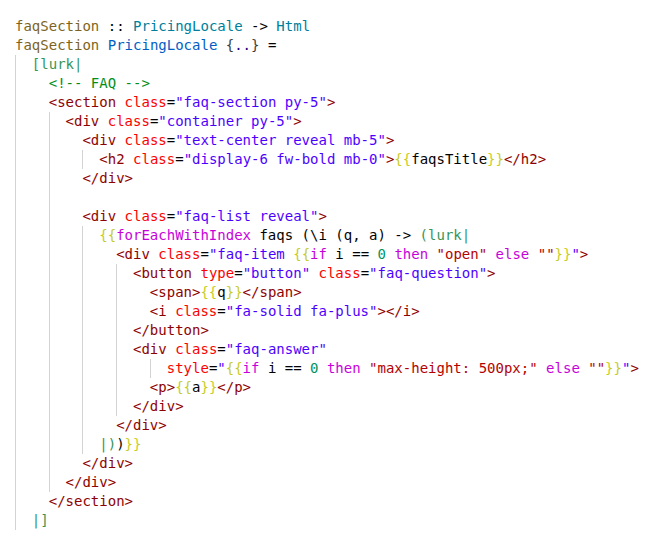

# Lurk QQ

Syntax highlighting for [Lurk](https://hackage.haskell.org/package/lurk) quasi-quoters in Haskell files.



## Features

- **Quasi-quotation highlighting:** `[lurk|...|]` and `[lurksql|...|]` blocks with embedded HTML/SQL syntax
- **Haskell interpolation:** `{{expr}}` inside lurk blocks highlights Haskell expressions
- **HLS integration:** proxy filters hover and document highlights to only show relevant info inside lurk blocks
- **Snippets:** `lurk`, `lurki`, `fe`, `fei`, `fmap`

## Configuration

Set the path to your HLS executable in VS Code settings:

```json
"lurk.hlsPath": "/path/to/haskell-language-server-wrapper"
```

If left empty, the proxy will look for `haskell-language-server-wrapper` on your `PATH`.

## Known Limitations

- Hover info for dot-notation expressions (e.g., `{{t.name}}`) is limited — HLS does not return field-level hover for record access
